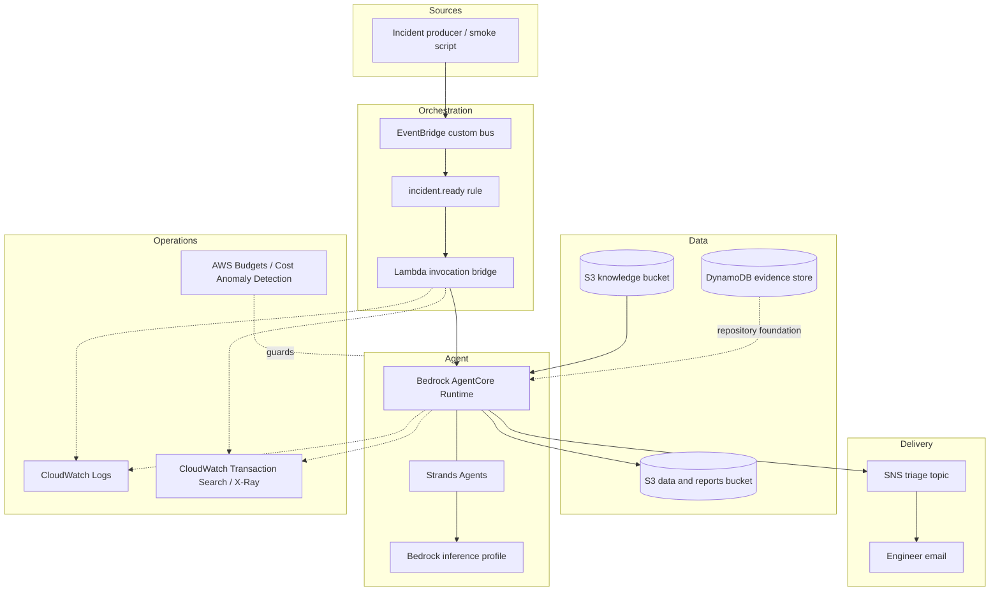

# Architecture

## Design goal

The PoC proves that a telecom reasoning skill can move through a secure, observable AWS event path without embedding a large corpus in the system prompt or coupling the knowledge bundle to one agent framework.

The design keeps three concerns separate:

1. **Deterministic cloud plumbing** receives events, controls access, stores state and delivers reports.
2. **Knowledge as code** defines the reasoning procedure and the bounded domain references.
3. **Model reasoning** interprets the loaded skill inside a managed AgentCore runtime.

## Component view



## Mapping to the AWS layered-context pattern

| AWS article layer | PoC implementation | Status |
|---|---|---|
| Reasoning layer | `knowledge/SKILL.md` loaded from S3 | Deployed and smoke-tested |
| Reference layer | Catalog, shared rules, five SOPs and four domain references in S3 | Deployed |
| Retrieval layer | Bedrock Knowledge Base + OpenSearch Serverless | Deliberately deferred |
| Agent runtime | Bedrock AgentCore with Strands Agents | Deployed |
| Foundation model | Claude Sonnet through Amazon Bedrock | Deployed |
| Ingress | EventBridge custom bus and rule | Deployed |
| Notification | SNS topic and email subscription | Deployed |

Catalog navigation is used for the bounded reference pack. A vector layer becomes useful when the corpus expands to thousands of vendor documents, release notes or historical incidents.

## Why the Lambda bridge exists

EventBridge can invoke Lambda directly but does not expose AgentCore Runtime as a native classic target. AgentCore invocation is a SigV4-authenticated data-plane call. The bridge therefore:

- validates the event envelope;
- creates a stable session identifier;
- invokes the exact AgentCore runtime ARN;
- consumes the streaming response so the asynchronous invocation completes;
- logs status and duration without becoming part of the reasoning workflow.

Its role is restricted to `bedrock-agentcore:InvokeAgentRuntime` on the project runtime and writes only to its own log group.

## Data boundaries

The knowledge bucket contains only agent-readable procedural material:

```text
SKILL.md
catalog.json
shared-rules.md
sops/*.md
reference/*.md
```

The sync script fails if names associated with scenarios, dictionaries or evaluation oracles appear in that bucket. Evidence and generated reports use the separate data bucket. Terraform state and local variable values never enter either bucket through the repository workflow.

## Deployment modes

The default is AgentCore direct code deployment:

```text
agent source + Linux ARM64 dependencies -> ZIP -> S3 -> AgentCore
```

This path avoids requiring Docker on a Windows development machine. The repository also provisions an encrypted ECR repository and includes a container build script as a fallback.

## Observability

The deployed demonstration enabled:

- active X-Ray tracing on the Lambda bridge;
- `aws-opentelemetry-distro` in the AgentCore package;
- AgentCore execution through `opentelemetry-instrument`;
- CloudWatch Transaction Search as the X-Ray trace-segment destination;
- seven-day application log retention.

One smoke run produced one correlated trace with 17 spans across Lambda, AgentCore, the Strands event loop, the Bedrock chat request, S3 and SNS.

Transaction Search is an account-wide, Region-wide setting. The public Terraform example keeps it disabled by default so a reader must opt in deliberately.

## Security posture

- No root credentials or access keys are stored in code.
- Runtime trust is limited to the AgentCore service, source account and AgentCore source ARN.
- S3 blocks public ACLs and policies, enforces bucket-owner control, encrypts objects and rejects non-TLS requests.
- AgentCore gets read-only access to approved knowledge, read/write access only to defined data prefixes, model invocation for the configured profile, SNS publish to one topic, and scoped logging permissions.
- The PoC does not expose a public API endpoint or any network-change action.
- Report notifications are outputs for a human engineer; they are not commands to the network.

## Scope boundary

The deployed `agent/main.py` is a walking skeleton. It validates the infrastructure and knowledge-loading path with a small model interaction. The full target design adds deterministic enrichment, nine evidence tools, structured report validation, late-event versioning and scenario-based evaluation. Those parts are described as future work rather than represented as completed code.
