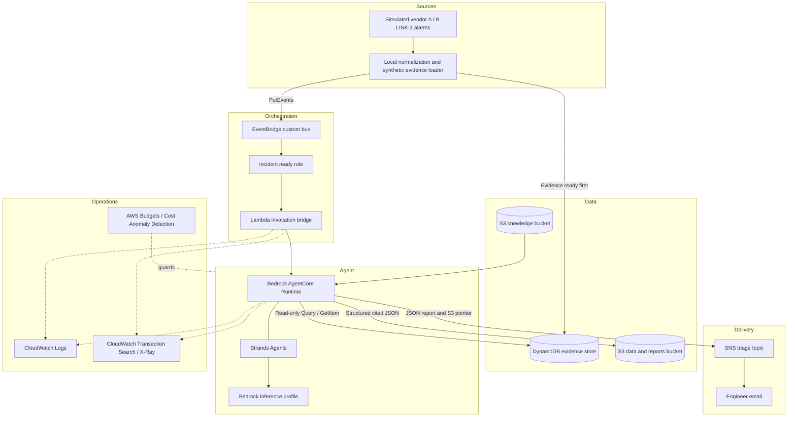

Architecture

## Design goal

The PoC proves that a telecom reasoning skill can move through a secure, observable AWS event path without embedding a large corpus in the system prompt or coupling the knowledge bundle to one agent framework.

The design keeps three concerns separate:

1. **Deterministic cloud plumbing** receives events, controls access, stores state and delivers reports.
2. **Knowledge as code** defines the reasoning procedure and the bounded domain references.
3. **Model reasoning** interprets the loaded skill inside a managed AgentCore runtime.

## Component view



## Mapping to the AWS layered-context pattern

| AWS article layer | PoC implementation | Status |
|---|---|---|
| Reasoning layer | `knowledge/SKILL.md` loaded from S3 | Deployed and smoke-tested |
| Reference layer | Catalog, shared rules, five SOPs and four domain references in S3 | Deployed |
| Retrieval layer | No vector store or Bedrock Knowledge Base | Not implemented; outside approved PoC scope |
| Agent runtime | Bedrock AgentCore with Strands Agents | Deployed |
| Foundation model | Claude Sonnet 4.5 through Amazon Bedrock | Deployed |
| Ingress | EventBridge custom bus and rule | Deployed |
| Notification | SNS topic and email subscription | Deployed |

Catalog navigation is used for the bounded reference pack. Relationships are static reference-file tables, not a queryable topology service. The alarm dictionary stays with the local simulator and is never supplied to the agent.

## Why the Lambda bridge exists

EventBridge can invoke Lambda directly but does not expose AgentCore Runtime as a native classic target. AgentCore invocation is a SigV4-authenticated data-plane call. The bridge therefore:

- rejects an event without an incident ID and forwards its run UUID;
- creates a fresh session identifier for each invocation;
- invokes the exact AgentCore runtime ARN;
- consumes the streaming response so the asynchronous invocation completes;
- logs invocation details, response status and a bounded response body without performing incident reasoning.

Its role permits `bedrock-agentcore:InvokeAgentRuntime` on the project runtime, logging to its own log group and X-Ray tracing.

## Data boundaries

The knowledge bucket contains only agent-readable procedural material:

```text
SKILL.md
catalog.json
shared-rules.md
sops/*.md
reference/*.md
```

The sync script uploads the three root files and the sops/reference directories, then checks bucket names for scenario, dictionary or oracle content. It does not yet strictly filter every uploaded file by extension. Normalized incident evidence is stored in DynamoDB under run-scoped keys; generated reports use the separate S3 data bucket. Raw alarm captures and operator dictionaries remain local. Private captured demo evidence stays in the gitignored demo-evidence/ directory. Terraform state and local variable values are gitignored.

## Deployment modes

The default is AgentCore direct code deployment:

```text
agent source + Linux ARM64 dependencies -> ZIP -> S3 -> AgentCore
```

This is the verified deployment path and avoids requiring Docker on a Windows development machine. Packaging includes the agent, store and evidence contract, with Linux ARM64 dependencies; it excludes simulator code, raw captures and the alarm dictionary. An encrypted ECR repository and a skeleton container build script remain from the initial setup. Container deployment of the current investigation agent has not been completed or verified.

## Observability

The deployed demonstration enabled:

- active X-Ray tracing on the Lambda bridge;
- `aws-opentelemetry-distro` in the AgentCore package;
- AgentCore execution through `opentelemetry-instrument`;
- CloudWatch Transaction Search as the X-Ray trace-segment destination;
- seven-day application log retention.

An earlier skeleton smoke run recorded a correlated trace with 17 spans across Lambda, AgentCore, the Strands event loop, Bedrock, S3 and SNS. That historical span count is not a fixed count for current investigations.

Transaction Search is an account-wide, Region-wide setting approved for this demo. Current Terraform defaults enable_observability to true and trace_indexing_percentage to 100. Set enable_observability = false explicitly when these account-wide settings should remain unmanaged.

## Security posture

- No root credentials or access keys are stored in code.
- Runtime trust is limited to the AgentCore service, source account and AgentCore source ARN.
- S3 blocks public ACLs and policies, enforces bucket-owner control, encrypts objects and rejects non-TLS requests.
- AgentCore gets read-only access to approved knowledge, read/write access only to defined data prefixes, model invocation for the configured profile, SNS publish to one topic, and scoped logging permissions.
- AgentCore uses PUBLIC network mode; the PoC does not add a public API Gateway or implement a network-change execution tool.
- Report notifications are outputs for a human engineer; they are not commands to the network.

## Scope boundary

The deployed agent performs structured incident investigation using Strands and eight bounded tools: list_sections, read_section, get_incident_events, get_kpis, get_changes, get_link_events, get_customer_impact and propose_action. It reads SKILL.md from S3, queries run-scoped DynamoDB evidence, checks citations and report structure, computes impact counts, and allows one correction attempt within a 40-tool-call budget. Validation checks structural consistency, not the truth of every model conclusion.

Reports remain synthetic and provisional. They are saved to S3 and included in SNS email, with an explicit pointer-only fallback if the inline report exceeds the message limit. Proposed network changes require engineer approval; the agent cannot execute them.

The verified end-to-end case is the transport/SOP-03 demo with simulated vendor A/B LINK-1 alarms and matching synthetic telemetry. Five SOPs are present in the knowledge pack, but complete core/RF input generators and S1–S8 evaluation remain pending. A real NMS/OSS feed, general event idempotency and deployed late-report revision are not implemented. Local report-version logic exists, but the runtime rejects previous_report_key. Issue #17 remains unresolved as logged.
